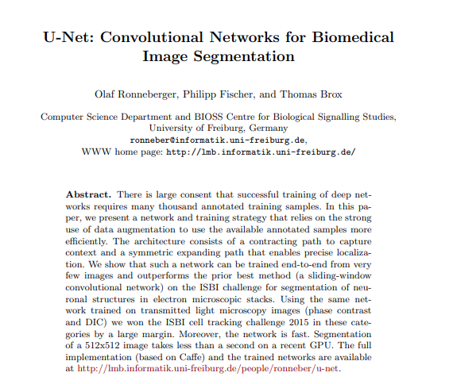
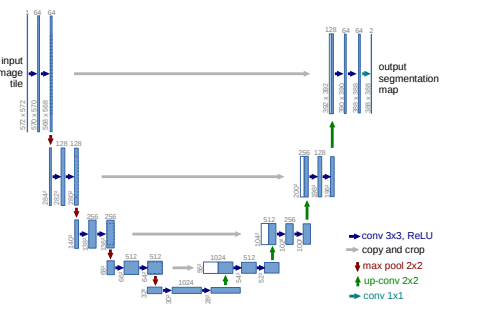

# UNets-from-Scratch-
Creating Original UNets using Pytorch

I attempted on creating an orginal Unet architecture from [paper](https://arxiv.org/abs/1505.04597) using Pytorch library.

You can also refer Abhishek Thakur's awesome [video](https://www.youtube.com/watch?v=u1loyDCoGbE) on this for implementation help

# The Paper

# Architecture

Happy Learning!!
